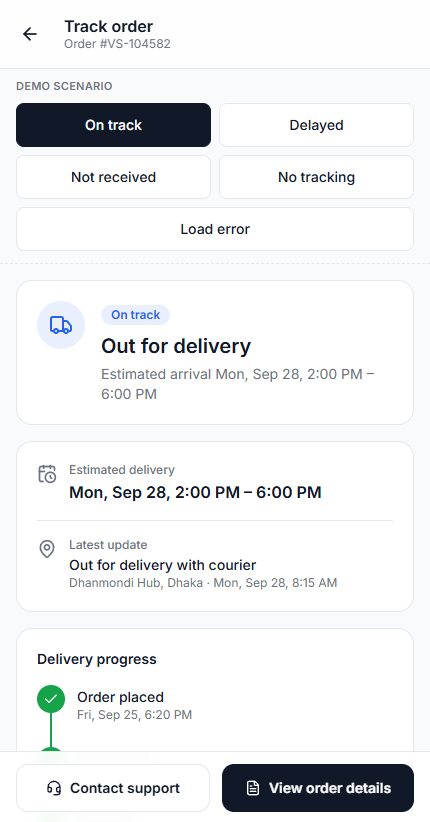
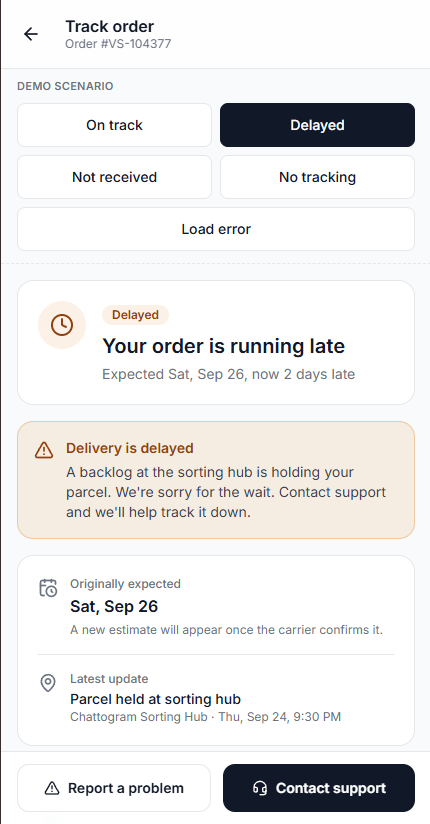
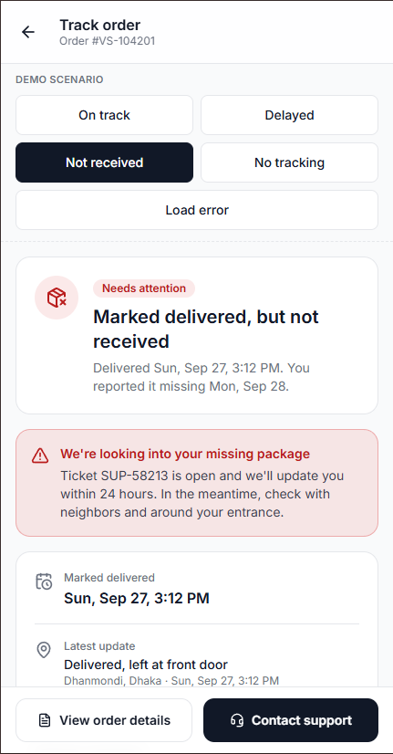
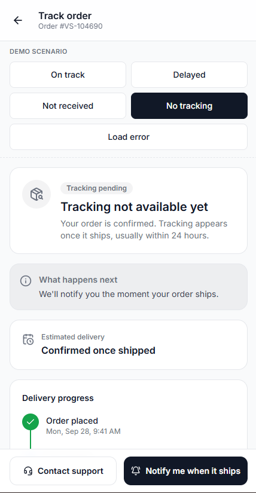

# Order Tracking Screen

A mobile-first order tracking experience that stays clear when things go wrong: delayed deliveries, packages marked delivered but not received, and orders with no tracking yet.

**Live demo:** https://vecosoft-order-tracking-red.vercel.app/

| On track | Delayed | Not received | No tracking |
| --- | --- | --- | --- |
|  |  |  |  |

> Tip: use the **Demo scenario** switcher at the top of the page to move between states, including a simulated **Load error**.

## The problem

Users reported that order status was hard to understand. The previous screen showed only four labels (Processing, Shipped, Out for Delivery, Delivered) with no timing, no context, and no way to act when something went wrong.

## What changed

- **Status at a glance:** one hero card with an icon, a status badge, a plain-language headline and a one-line explanation.
- **Five-step timeline:** completed, current and upcoming steps with timestamps. An "Order placed" step was added so users see progress from the very beginning.
- **ETA and latest update:** the delivery window plus the most recent carrier scan and location.
- **Order summary:** item, quantity and total, expandable to full details, delivery address and tracking number.
- **Support always reachable:** a sticky action bar whose primary action changes with the situation.
- **Loading, error and empty handling:** a skeleton loader, a retry on failure, and a helpful "tracking pending" screen instead of a blank one.

## The three required situations

| Situation | What the user sees | Next step offered |
| --- | --- | --- |
| **Delayed order** | Amber banner with the original date, how many days late, the reason and an apology. The current timeline step is flagged. | Contact support, report a problem |
| **Delivered but not received** | Red banner with the delivery time and the open ticket number. The "Delivered" step is flagged. | Contact support, view details, and a report flow with quick checks (neighbors, mailbox, courier note) |
| **Tracking not available yet** | A neutral card explaining that tracking appears once the order ships, usually within 24 hours. The timeline still shows progress and the order summary stays visible. | Get notified when it ships, contact support |

The same components render all three states. Only the data changes.

## Design decisions

- **Color only means state.** The interface stays neutral (navy, white, gray). Blue is the current step, green is completed, gray is upcoming, and amber or red signal a problem. Status never relies on color alone: every state also has an icon and text.
- **Plain language over status codes.** "Out for delivery" with "Estimated arrival Mon, Sep 28, 2:00 PM – 6:00 PM" instead of an internal status value.
- **Never a dead end.** Every state, including missing tracking data, tells the user what is happening and what they can do next.
- **One view model, many states.** A pure function, `deriveTrackingView`, turns an order into everything the UI needs (tone, headline, banner, ETA, steps and actions). Components stay generic, and the three situations come from data. This keeps the logic easy to unit test and easy to extend with new states.
- **Accessible by default.** Semantic lists, `aria-current` on the active step, live regions for status changes, Radix Dialog for focus trapping and Esc handling in sheets, 44px minimum touch targets, visible focus rings, and reduced-motion support.
- **Mobile first.** Designed for roughly 360 to 430px widths, with the app centered in a phone-width container on larger screens.

## Tech stack

- React and TypeScript (strict mode), built with Vite
- Tailwind CSS v4 with design tokens defined in `@theme`
- Radix UI Dialog for accessible bottom sheets
- lucide-react for icons
- Vitest and Testing Library for unit tests
- ESLint, Prettier, Husky and commitlint to enforce code quality and Conventional Commits

## Getting started

```bash
git clone https://github.com/mmahadi-ahmedd/vecosoft-order-tracking.git
cd vecosoft-order-tracking
npm install
npm run dev
```

Other scripts:

```bash
npm test          # run unit tests
npm run lint      # lint the codebase
npm run build     # type-check and create a production build
```

## Project structure

```
src/
  components/
    layout/     app shell and header
    tracking/   status hero, timeline, ETA card, order summary, alert banner, support actions
    sheets/     bottom sheet, report issue sheet, contact support sheet
    states/     loading skeleton and error state
    ui/         toast
    dev/        demo scenario switcher
  data/         mock orders for every scenario
  hooks/        useOrderTracking (simulated loading and errors)
  lib/          deriveTrackingView, formatting helpers, tone styles
  types/        domain types
```

## Testing

Unit tests cover the state logic that drives the screen: scenario detection, timeline progress, delay handling, the delivered-but-not-received case, and the missing-tracking case.

```bash
npm test
```

## Assumptions and trade-offs

- Backend integration was not required, so all data is mocked. A fixed "current time" keeps the demo scenarios deterministic.
- The support and report flows are simulated. Submitting a report shows a generated ticket number, and "Live chat" shows a confirmation toast.
- A "delayed" order is detected when the estimated delivery window has passed without the order being delivered.
- The demo scenario switcher exists only to review every state and would not ship in production.

## Future improvements

- Real-time updates and push notifications
- A map view for orders that are out for delivery
- Localization and right-to-left support
- Proof-of-delivery photos for the "delivered but not received" flow
- End-to-end tests with Playwright
